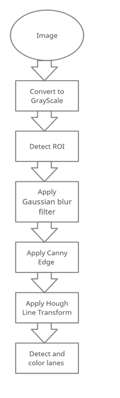
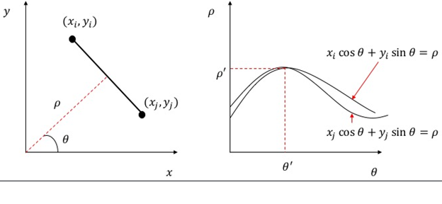

# Road driving by SmartCar kit using Raspberry Pi

 *The goal* of this task comprises of road driving on the racing map by using **OpenCv**. Car (A SmartCar kit using Raspberry Pi) must autonomously complete the missions and remote controls of any sorts are not allowed.

There are 3 files:
1. main.py
2. motor.py
3. ultra.py

```
main.py file contains the setups of all PINS and the initialization of all hardware equipment like DC Motor
ultra.py contains the code to measure the distance between the obstacle and the car
main.py combines all components and has control over them. In addition, the algorithm for lane detecting is implemented inside this file.
```

## Lane Detection Algorithm
The lane recognition algorithm begins by obtaining a road image on the map using a camera mounted in our car. The image is next transformed to grayscale and obtained ROI (Region of Interest) to select the area of interest we require from the image, allowing us to proceed with the remaining processes. Second, the existence of noise in the image will make proper edge recognition difficult. As a result, noise should be removed using filters. Gaussian blur is used, which is an important component of image processing methods. The edge detection is then used to generate an edge image by applying a Canny Edge Detection technique on the edges. After detecting the edges, the edged image is transferred to the line detector, which creates a right and left lane border segment. The information in the edge picture is identified by the Hough transform which is used to execute the lane boundary scan. A succession of points on the right and left sides are returned by the scan. Finally, these data points are adjusted with a pair of hyperbolas to represent the lane boundaries.
The below diagram illustrates the whole of the above-mentioned process visually:



### Here is the code of above mentioned algorithm with detailed explanation

Firstly, we need to convert an RGB colorspace image to a Grayscale image before applying edge detection.

```
gray = cv.cvtColor(img, cv.COLOR_BGR2GRAY)
```
Then, apply Gaussian blur filter to remove unnecessary noises from the frame

```
blur = cv.GaussianBlur(gray, (5, 5), 0)
```
Next step is to use Edge detection technique to identify the boundaries of objects within in frame

```
canny = cv.Canny(blur, 60, 130)
```

Once we get edges, we can use Probabilistic Hough Line Transform (It returns the identified lines' extremes as an output.) to detect straight lines in the image with the goal of identifying the lane lines on the map



```
linesP = cv.HoughLinesP(canny, 1, np.pi/180, 10, 5, 10)
```

Finally, we display the result by drawing the lines:

```
if(linesP is not None):
            for i in range(0, len(linesP)):
                for x1, y1, x2, y2 in linesP[i]:
                    cv.line(img,(x1,y1),(x2,y2),(0,0,255),5)
                    slope = slope+np.arctan((y2-y1)/(x2-x1))
```


[Here is a link to a demo video.](https://www.youtube.com/watch?v=9bltv04unt4)


